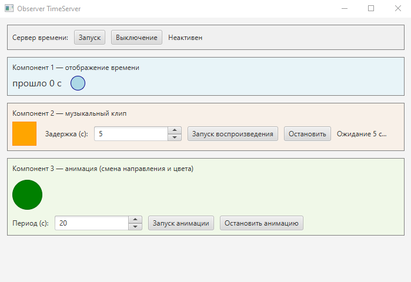
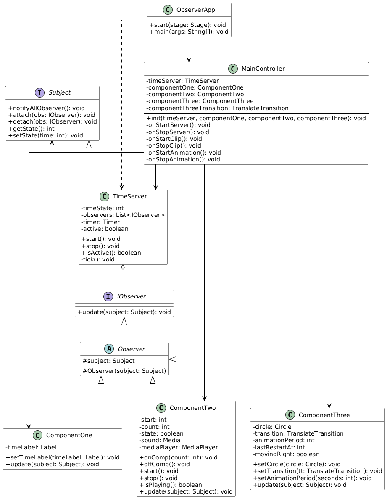

# Observer TimeServer (JavaFX)
----------------

**Описание**: Демонстрационное приложение на Java, реализующее паттерн **Observer** в связке с JavaFX. Единый источник времени — сервер (`TimeServer`) — раз в секунду обновляет своё состояние и уведомляет подписанных наблюдателей. Три компонента по-разному реагируют на тики: отображают «прошло N с», запускают музыкальный клип по расписанию и перезапускают анимацию круга со сменой цвета и направления. 

  - **Технологический стек**: Java 11, Maven, JavaFX 21 (Controls, FXML, Media).  Standalone-приложение с графическим интерфейсом.
  - **Статус**: Учебный/демо проект (Beta).
  - **Ссылка на продукт или демо-экземпляр**: Локальный запуск через Maven (см. раздел «Установка»).
  - **Отличие от типовых примеров Observer**: Фокус на чистой реализации Observer с одним Subject (TimeServer) и тремя разными наблюдателями (отображение, звук, анимация) в одном JavaFX-окне.

**Скриншот рабочего окна приложения**:

## Архитектура

Диаграмма классов модели (паттерн Observer + точка входа и контроллер). Пакет `observer` в `src/main/java`: интерфейсы Subject/IObserver, абстрактный Observer, реализация Subject (TimeServer), три конкретных наблюдателя (ComponentOne, ComponentTwo, ComponentThree), контроллер FXML (MainController), точка входа (ObserverApp).

## Зависимости

- **JDK 11** (или совместимая).
- **Maven 3.6+** для сборки.
- Зависимости из `pom.xml`: `javafx-controls`, `javafx-fxml`, `javafx-media` (OpenJFX 21.0.1). Maven подтягивает их автоматически.
- Для воспроизведения звука в ComponentTwo: аудиофайл `vivo.mp3` (например, src/main/resources/vivo.mp3). Без файла приложение работает, звук не воспроизводится.

## Установка

1. Клонировать репозиторий, перейти в корень проекта.
2. Убедиться, что установлены JDK 11 и Maven.
3. Собрать: `mvn clean compile`
4. Запуск: `mvn javafx:run` (mainClass — `observer.ObserverApp`).

## Конфигурация

Специальная конфигурация не требуется. 
Путь к аудиофайлу задаётся при создании `ComponentTwo` в `ObserverApp.start()` (сначала проверяется `src/main/resources/vivo.mp3`).

## Применение

После запуска: 
- кнопки «Запуск»/«Выключение» — старт/остановка сервера времени; 
- компонент 1 показывает «прошло N с»; 
- компонент 2 — задержка (спиннер), «Запуск воспроизведения»/«Остановить»; 
- компонент 3 — период анимации (спиннер), «Запуск анимации»/«Остановить анимацию». 

## Проверка ПО

Автотесты в проекте не описаны.

## Проблемы

При отсутствии `vivo.mp3` ComponentTwo не воспроизводит звук, остальная логика работает.

## Получение справочной информации

Если есть вопросы, ошибки или предложения — создайте issue в репозитории проекта.

## Приглашение к сотрудничеству

Приветствуются: доработка тестов, рефакторинг (вынос констант, улучшение имён), опциональная настройка путей к ресурсам, документация (CHANGELOG, INSTALL).

----

## Open source licensing info
1. [TERMS](TERMS.md)
2. [LICENSE](LICENSE)
3. (при необходимости — ссылка на политику исходного кода)

----

## Источники и справочники
1. Паттерн Observer — GoF, «Приёмы объектно-ориентированного проектирования».
2. Документация JavaFX (OpenJFX), в частности Application, FXML, Media, Platform.runLater.
3. Учебные материалы курса по ООП
